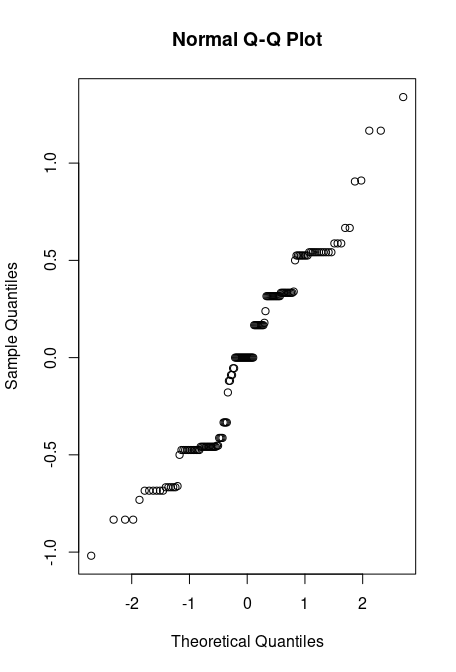

Final Report
================
Kayla Howa
2025-11-10

# ABSTRACT

# STUDY QUESTION & HYPOTHESIS

## Question

Does pruning trees lead to an increase in fruit yield in apple trees?

## Hypothesis

I hypothesize that pruning trees leads to an increase in fruit yield in
apple trees.

## Prediction

I predict that by pruning fruit bearing trees, such as apples, the fruit
yield will increase for the following harvest season.

# METHODS

### Method 1

### Method 2

### Method 3

### Analysis

## First Analysis

``` r
##Chi-Square Test
chisq.test(apples$pruned, apples$harvest)
```

    ## 
    ##  Pearson's Chi-squared test
    ## 
    ## data:  apples$pruned and apples$harvest
    ## X-squared = 2.6009, df = 2, p-value = 0.2724

``` r
##ANOVA
```

## Second Analysis

``` r
## Creating a linear model to try and determine whether pruning impacts apple harvest abundance
apple_lm <- lm(harvest ~ pruned + elevation, data = apples)
appleResids <- apple_lm$residuals
qqnorm(appleResids)
```



``` r
appleANOVA <- aov(apple_lm)
summary(appleANOVA)
```

    ##              Df Sum Sq Mean Sq F value   Pr(>F)    
    ## pruned        1   0.92  0.9250   3.298 0.071887 .  
    ## elevation    25  17.87  0.7149   2.549 0.000403 ***
    ## Residuals   118  33.09  0.2804                     
    ## ---
    ## Signif. codes:  0 '***' 0.001 '**' 0.01 '*' 0.05 '.' 0.1 ' ' 1
    ## 97 observations deleted due to missingness

``` r
TukeyHSD(appleANOVA, "elevation")
```

    ##   Tukey multiple comparisons of means
    ##     95% family-wise confidence level
    ## 
    ## Fit: aov(formula = apple_lm)
    ## 
    ## $elevation
    ##                    diff        lwr         upr     p adj
    ## 5500-5400 -1.080894e+00 -3.5247684  1.36298073 0.9949651
    ## 5550-5400 -4.044692e-02 -1.7685272  1.68763336 1.0000000
    ## 5580-5400 -2.095531e-01 -1.9376334  1.51852719 1.0000000
    ## 5584-5400  9.730354e-01 -0.8485212  2.79459194 0.9512000
    ## 5585-5400  8.089383e-02 -2.3629807  2.52476839 1.0000000
    ## 5600-5400 -3.598723e-01 -1.8105974  1.09085278 0.9999998
    ## 5604-5400 -9.191062e-01 -2.7406627  0.90245038 0.9736962
    ## 5616-5400 -9.191062e-01 -3.3629807  1.52476839 0.9995560
    ## 5633-5400  4.142272e-01 -1.4073294  2.23578371 1.0000000
    ## 5663-5400 -4.607728e-01 -1.9293587  1.00781300 0.9999810
    ## 5700-5400 -2.524395e-01 -1.7545335  1.24965451 1.0000000
    ## 5750-5400  5.808938e-01 -1.4145214  2.57630905 0.9999954
    ## 5770-5400 -8.089383e-02 -1.9024504  1.74066271 1.0000000
    ## 5784-5400 -9.191062e-01 -2.9145214  1.07630905 0.9913448
    ## 5900-5400 -1.080894e+00 -3.0763091  0.91452139 0.9437541
    ## 6000-5400 -3.966833e-01 -1.8800589  1.08669229 0.9999991
    ## 6080-5400  8.089383e-02 -2.3629807  2.52476839 1.0000000
    ## 6500-5400 -7.116077e-01 -2.2714955  0.84828015 0.9923700
    ## 6692-5400 -9.191062e-01 -3.3629807  1.52476839 0.9995560
    ## 6700-5400 -6.936313e-01 -2.5151878  1.12792527 0.9994576
    ## 6710-5400 -7.475605e-01 -2.5691170  1.07399605 0.9982734
    ## 6720-5400 -8.089383e-02 -2.5247684  2.36298073 1.0000000
    ## 7000-5400  8.089383e-02 -2.3629807  2.52476839 1.0000000
    ## 7162-5400  8.089383e-02 -2.3629807  2.52476839 1.0000000
    ## 7200-5400 -1.080894e+00 -3.5247684  1.36298073 0.9949651
    ## 5550-5500  1.040447e+00 -1.1904951  3.27138896 0.9898402
    ## 5580-5500  8.713407e-01 -1.3596013  3.10228279 0.9991896
    ## 5584-5500  2.053929e+00 -0.2501778  4.35803625 0.1550861
    ## 5585-5500  1.161788e+00 -1.6601556  3.98373093 0.9981902
    ## 5600-5500  7.210215e-01 -1.3026989  2.74474192 0.9998188
    ## 5604-5500  1.617877e-01 -2.1423194  2.46589470 1.0000000
    ## 5616-5500  1.617877e-01 -2.6601556  2.98373093 1.0000000
    ## 5633-5500  1.495121e+00 -0.8089860  3.79922803 0.7484083
    ## 5663-5500  6.201210e-01 -1.4164411  2.65668313 0.9999891
    ## 5700-5500  8.284543e-01 -1.2324016  2.88931031 0.9987355
    ## 5750-5500  1.661788e+00 -0.7820869  4.10566222 0.6651436
    ## 5770-5500  1.000000e+00 -1.3041070  3.30410703 0.9961243
    ## 5784-5500  1.617877e-01 -2.2820869  2.60566222 1.0000000
    ## 5900-5500  0.000000e+00 -2.4438746  2.44387456 1.0000000
    ## 6000-5500  6.842105e-01 -1.3630423  2.73146335 0.9999402
    ## 6080-5500  1.161788e+00 -1.6601556  3.98373093 0.9981902
    ## 6500-5500  3.692861e-01 -1.7340662  2.47263847 1.0000000
    ## 6692-5500  1.617877e-01 -2.6601556  2.98373093 1.0000000
    ## 6700-5500  3.872626e-01 -1.9168445  2.69136959 1.0000000
    ## 6710-5500  3.333333e-01 -1.9707737  2.63744036 1.0000000
    ## 6720-5500  1.000000e+00 -1.8219433  3.82194327 0.9998346
    ## 7000-5500  1.161788e+00 -1.6601556  3.98373093 0.9981902
    ## 7162-5500  1.161788e+00 -1.6601556  3.98373093 0.9981902
    ## 7200-5500  1.110223e-16 -2.8219433  2.82194327 1.0000000
    ## 5580-5550 -1.691062e-01 -1.5800778  1.24186547 1.0000000
    ## 5584-5550  1.013482e+00 -0.5105412  2.53750585 0.7062323
    ## 5585-5550  1.213407e-01 -2.1096013  2.35228279 1.0000000
    ## 5600-5550 -3.194254e-01 -1.3726029  0.73375209 0.9999899
    ## 5604-5550 -8.786593e-01 -2.4026828  0.64536430 0.8986774
    ## 5616-5550 -8.786593e-01 -3.1096013  1.35228279 0.9990768
    ## 5633-5550  4.546741e-01 -1.0693495  1.97869763 0.9999926
    ## 5663-5550 -4.203259e-01 -1.4979733  0.65732147 0.9992067
    ## 5700-5550 -2.119926e-01 -1.3348755  0.91089028 1.0000000
    ## 5750-5550  6.213407e-01 -1.1067395  2.34942102 0.9997886
    ## 5770-5550 -4.044692e-02 -1.5644705  1.48357663 1.0000000
    ## 5784-5550 -8.786593e-01 -2.6067395  0.84942102 0.9713131
    ## 5900-5550 -1.040447e+00 -2.7685272  0.68763336 0.8540534
    ## 6000-5550 -3.562364e-01 -1.4539534  0.74148064 0.9999647
    ## 6080-5550  1.213407e-01 -2.1096013  2.35228279 1.0000000
    ## 6500-5550 -6.711608e-01 -1.8702561  0.52793455 0.9226604
    ## 6692-5550 -8.786593e-01 -3.1096013  1.35228279 0.9990768
    ## 6700-5550 -6.531844e-01 -2.1772079  0.87083919 0.9967534
    ## 6710-5550 -7.071136e-01 -2.2311371  0.81690997 0.9904891
    ## 6720-5550 -4.044692e-02 -2.2713890  2.19049512 1.0000000
    ## 7000-5550  1.213407e-01 -2.1096013  2.35228279 1.0000000
    ## 7162-5550  1.213407e-01 -2.1096013  2.35228279 1.0000000
    ## 7200-5550 -1.040447e+00 -3.2713890  1.19049512 0.9898402
    ## 5584-5580  1.182588e+00 -0.3414351  2.70661202 0.3939404
    ## 5585-5580  2.904469e-01 -1.9404951  2.52138896 1.0000000
    ## 5600-5580 -1.503192e-01 -1.2034967  0.90285826 1.0000000
    ## 5604-5580 -7.095531e-01 -2.2335766  0.81447047 0.9900589
    ## 5616-5580 -7.095531e-01 -2.9404951  1.52138896 0.9999756
    ## 5633-5580  6.237802e-01 -0.9002433  2.14780380 0.9983411
    ## 5663-5580 -2.512198e-01 -1.3288671  0.82642764 0.9999999
    ## 5700-5580 -4.288642e-02 -1.1657693  1.07999645 1.0000000
    ## 5750-5580  7.904469e-01 -0.9376334  2.51852719 0.9920971
    ## 5770-5580  1.286593e-01 -1.3953643  1.65268280 1.0000000
    ## 5784-5580 -7.095531e-01 -2.4376334  1.01852719 0.9982605
    ## 5900-5580 -8.713407e-01 -2.5994210  0.85673952 0.9739013
    ## 6000-5580 -1.871302e-01 -1.2848473  0.91058681 1.0000000
    ## 6080-5580  2.904469e-01 -1.9404951  2.52138896 1.0000000
    ## 6500-5580 -5.020546e-01 -1.7011499  0.69704071 0.9976808
    ## 6692-5580 -7.095531e-01 -2.9404951  1.52138896 0.9999756
    ## 6700-5580 -4.840782e-01 -2.0081017  1.03994536 0.9999761
    ## 6710-5580 -5.380074e-01 -2.0620310  0.98601613 0.9998450
    ## 6720-5580  1.286593e-01 -2.1022828  2.35960129 1.0000000
    ## 7000-5580  2.904469e-01 -1.9404951  2.52138896 1.0000000
    ## 7162-5580  2.904469e-01 -1.9404951  2.52138896 1.0000000
    ## 7200-5580 -8.713407e-01 -3.1022828  1.35960129 0.9991896
    ## 5585-5584 -8.921416e-01 -3.1962486  1.41196547 0.9992929
    ## 5600-5584 -1.332908e+00 -2.5333200 -0.13249542 0.0128906
    ## 5604-5584 -1.892142e+00 -3.5213913 -0.26289185 0.0065003
    ## 5616-5584 -1.892142e+00 -4.1962486  0.41196547 0.2836992
    ## 5633-5584 -5.588082e-01 -2.1880579  1.07044148 0.9999057
    ## 5663-5584 -1.433808e+00 -2.6557455 -0.21187094 0.0055037
    ## 5700-5584 -1.225475e+00 -2.4874863  0.03653651 0.0690742
    ## 5750-5584 -3.921416e-01 -2.2136981  1.42941499 1.0000000
    ## 5770-5584 -1.053929e+00 -2.6831789  0.57532048 0.7535035
    ## 5784-5584 -1.892142e+00 -3.7136981 -0.07058501 0.0317359
    ## 5900-5584 -2.053929e+00 -3.8754858 -0.23237267 0.0102719
    ## 6000-5584 -1.369719e+00 -2.6093918 -0.13004555 0.0138450
    ## 6080-5584 -8.921416e-01 -3.1962486  1.41196547 0.9992929
    ## 6500-5584 -1.684643e+00 -3.0149199 -0.35436626 0.0014367
    ## 6692-5584 -1.892142e+00 -4.1962486  0.41196547 0.2836992
    ## 6700-5584 -1.666667e+00 -3.2959164 -0.03741696 0.0383040
    ## 6710-5584 -1.720596e+00 -3.3498456 -0.09134618 0.0257026
    ## 6720-5584 -1.053929e+00 -3.3580363  1.25017781 0.9920971
    ## 7000-5584 -8.921416e-01 -3.1962486  1.41196547 0.9992929
    ## 7162-5584 -8.921416e-01 -3.1962486  1.41196547 0.9992929
    ## 7200-5584 -2.053929e+00 -4.3580363  0.25017781 0.1550861
    ## 5600-5585 -4.407661e-01 -2.4644865  1.58295425 1.0000000
    ## 5604-5585 -1.000000e+00 -3.3041070  1.30410703 0.9961243
    ## 5616-5585 -1.000000e+00 -3.8219433  1.82194327 0.9998346
    ## 5633-5585  3.333333e-01 -1.9707737  2.63744036 1.0000000
    ## 5663-5585 -5.416667e-01 -2.5782288  1.49489547 0.9999992
    ## 5700-5585 -3.333333e-01 -2.3941893  1.72752265 1.0000000
    ## 5750-5585  5.000000e-01 -1.9438746  2.94387456 1.0000000
    ## 5770-5585 -1.617877e-01 -2.4658947  2.14231936 1.0000000
    ## 5784-5585 -1.000000e+00 -3.4438746  1.44387456 0.9983478
    ## 5900-5585 -1.161788e+00 -3.6056622  1.28208689 0.9870640
    ## 6000-5585 -4.775771e-01 -2.5248300  1.56967568 0.9999999
    ## 6080-5585  0.000000e+00 -2.8219433  2.82194327 1.0000000
    ## 6500-5585 -7.925015e-01 -2.8958538  1.31085081 0.9995426
    ## 6692-5585 -1.000000e+00 -3.8219433  1.82194327 0.9998346
    ## 6700-5585 -7.745251e-01 -3.0786321  1.52958192 0.9999338
    ## 6710-5585 -8.284543e-01 -3.1325614  1.47565270 0.9997886
    ## 6720-5585 -1.617877e-01 -2.9837309  2.66015560 1.0000000
    ## 7000-5585 -4.440892e-16 -2.8219433  2.82194327 1.0000000
    ## 7162-5585 -4.440892e-16 -2.8219433  2.82194327 1.0000000
    ## 7200-5585 -1.161788e+00 -3.9837309  1.66015560 0.9981902
    ## 5604-5600 -5.592339e-01 -1.7596461  0.64117842 0.9899795
    ## 5616-5600 -5.592339e-01 -2.5829543  1.46448654 0.9999983
    ## 5633-5600  7.740995e-01 -0.4263128  1.97451176 0.7585681
    ## 5663-5600 -1.009005e-01 -0.6297349  0.42793381 1.0000000
    ## 5700-5600  1.074328e-01 -0.5083657  0.72323132 1.0000000
    ## 5750-5600  9.407661e-01 -0.5099589  2.39149123 0.7494591
    ## 5770-5600  2.789785e-01 -0.9214338  1.47939076 1.0000000
    ## 5784-5600 -5.592339e-01 -2.0099589  0.89149123 0.9993407
    ## 5900-5600 -7.210215e-01 -2.1717466  0.72970357 0.9778932
    ## 6000-5600 -3.681100e-02 -0.6054273  0.53180535 1.0000000
    ## 6080-5600  4.407661e-01 -1.5829543  2.46448654 1.0000000
    ## 6500-5600 -3.517354e-01 -1.0975044  0.39403365 0.9882837
    ## 6692-5600 -5.592339e-01 -2.5829543  1.46448654 0.9999983
    ## 6700-5600 -3.337590e-01 -1.5341712  0.86665331 0.9999981
    ## 6710-5600 -3.876882e-01 -1.5881005  0.81272409 0.9999677
    ## 6720-5600  2.789785e-01 -1.7447419  2.30269887 1.0000000
    ## 7000-5600  4.407661e-01 -1.5829543  2.46448654 1.0000000
    ## 7162-5600  4.407661e-01 -1.5829543  2.46448654 1.0000000
    ## 7200-5600 -7.210215e-01 -2.7447419  1.30269887 0.9998188
    ## 5616-5604 -2.220446e-16 -2.3041070  2.30410703 1.0000000
    ## 5633-5604  1.333333e+00 -0.2959164  2.96258304 0.2900092
    ## 5663-5604  4.583333e-01 -0.7636039  1.68027061 0.9995747
    ## 5700-5604  6.666667e-01 -0.5953447  1.92867806 0.9565453
    ## 5750-5604  1.500000e+00 -0.3215565  3.32155655 0.2787063
    ## 5770-5604  8.382123e-01 -0.7910374  2.46746204 0.9673037
    ## 5784-5604 -4.440892e-16 -1.8215565  1.82155655 1.0000000
    ## 5900-5604 -1.617877e-01 -1.9833442  1.65976888 1.0000000
    ## 6000-5604  5.224229e-01 -0.7172503  1.76209601 0.9974515
    ## 6080-5604  1.000000e+00 -1.3041070  3.30410703 0.9961243
    ## 6500-5604  2.074985e-01 -1.1227783  1.53777530 1.0000000
    ## 6692-5604  0.000000e+00 -2.3041070  2.30410703 1.0000000
    ## 6700-5604  2.254749e-01 -1.4037748  1.85472460 1.0000000
    ## 6710-5604  1.715457e-01 -1.4577040  1.80079537 1.0000000
    ## 6720-5604  8.382123e-01 -1.4658947  3.14231936 0.9997428
    ## 7000-5604  1.000000e+00 -1.3041070  3.30410703 0.9961243
    ## 7162-5604  1.000000e+00 -1.3041070  3.30410703 0.9961243
    ## 7200-5604 -1.617877e-01 -2.4658947  2.14231936 1.0000000
    ## 5633-5616  1.333333e+00 -0.9707737  3.63744036 0.8953223
    ## 5663-5616  4.583333e-01 -1.5782288  2.49489547 1.0000000
    ## 5700-5616  6.666667e-01 -1.3941893  2.72752265 0.9999667
    ## 5750-5616  1.500000e+00 -0.9438746  3.94387456 0.8303856
    ## 5770-5616  8.382123e-01 -1.4658947  3.14231936 0.9997428
    ## 5784-5616 -2.220446e-16 -2.4438746  2.44387456 1.0000000
    ## 5900-5616 -1.617877e-01 -2.6056622  2.28208689 1.0000000
    ## 6000-5616  5.224229e-01 -1.5248300  2.56967568 0.9999997
    ## 6080-5616  1.000000e+00 -1.8219433  3.82194327 0.9998346
    ## 6500-5616  2.074985e-01 -1.8958538  2.31085081 1.0000000
    ## 6692-5616  2.220446e-16 -2.8219433  2.82194327 1.0000000
    ## 6700-5616  2.254749e-01 -2.0786321  2.52958192 1.0000000
    ## 6710-5616  1.715457e-01 -2.1325614  2.47565270 1.0000000
    ## 6720-5616  8.382123e-01 -1.9837309  3.66015560 0.9999932
    ## 7000-5616  1.000000e+00 -1.8219433  3.82194327 0.9998346
    ## 7162-5616  1.000000e+00 -1.8219433  3.82194327 0.9998346
    ## 7200-5616 -1.617877e-01 -2.9837309  2.66015560 1.0000000
    ## 5663-5633 -8.750000e-01 -2.0969373  0.34693728 0.5619010
    ## 5700-5633 -6.666667e-01 -1.9286781  0.59534473 0.9565453
    ## 5750-5633  1.666667e-01 -1.6548899  1.98822321 1.0000000
    ## 5770-5633 -4.951210e-01 -2.1243707  1.13412871 0.9999895
    ## 5784-5633 -1.333333e+00 -3.1548899  0.48822321 0.5160160
    ## 5900-5633 -1.495121e+00 -3.3166775  0.32643555 0.2846094
    ## 6000-5633 -8.109105e-01 -2.0505836  0.42876267 0.7349604
    ## 6080-5633 -3.333333e-01 -2.6374404  1.97077370 1.0000000
    ## 6500-5633 -1.125835e+00 -2.4561117  0.20444196 0.2315066
    ## 6692-5633 -1.333333e+00 -3.6374404  0.97077370 0.8953223
    ## 6700-5633 -1.107858e+00 -2.7371081  0.52139126 0.6651436
    ## 6710-5633 -1.161788e+00 -2.7910374  0.46746204 0.5705650
    ## 6720-5633 -4.951210e-01 -2.7992280  1.80898603 1.0000000
    ## 7000-5633 -3.333333e-01 -2.6374404  1.97077370 1.0000000
    ## 7162-5633 -3.333333e-01 -2.6374404  1.97077370 1.0000000
    ## 7200-5633 -1.495121e+00 -3.7992280  0.80898603 0.7484083
    ## 5700-5663  2.083333e-01 -0.4484382  0.86510489 0.9999767
    ## 5750-5663  1.041667e+00 -0.4269192  2.51025251 0.5815024
    ## 5770-5663  3.798790e-01 -0.8420583  1.60181628 0.9999839
    ## 5784-5663 -4.583333e-01 -1.9269192  1.01025251 0.9999828
    ## 5900-5663 -6.201210e-01 -2.0887068  0.84846484 0.9973772
    ## 6000-5663  6.408953e-02 -0.5486630  0.67684202 1.0000000
    ## 6080-5663  5.416667e-01 -1.4948955  2.57822880 0.9999992
    ## 6500-5663 -2.508349e-01 -1.0307788  0.52910907 0.9999701
    ## 6692-5663 -4.583333e-01 -2.4948955  1.57822880 1.0000000
    ## 6700-5663 -2.328584e-01 -1.4547957  0.98907884 1.0000000
    ## 6710-5663 -2.867877e-01 -1.5087249  0.93514961 0.9999999
    ## 6720-5663  3.798790e-01 -1.6566831  2.41644113 1.0000000
    ## 7000-5663  5.416667e-01 -1.4948955  2.57822880 0.9999992
    ## 7162-5663  5.416667e-01 -1.4948955  2.57822880 0.9999992
    ## 7200-5663 -6.201210e-01 -2.6566831  1.41644113 0.9999891
    ## 5750-5700  8.333333e-01 -0.6687607  2.33542734 0.9289060
    ## 5770-5700  1.715457e-01 -1.0904657  1.43355706 1.0000000
    ## 5784-5700 -6.666667e-01 -2.1687607  0.83542734 0.9947206
    ## 5900-5700 -8.284543e-01 -2.3305483  0.67363968 0.9328174
    ## 6000-5700 -1.442438e-01 -0.8334518  0.54496419 1.0000000
    ## 6080-5700  3.333333e-01 -1.7275226  2.39418931 1.0000000
    ## 6500-5700 -4.591682e-01 -1.3005091  0.38217275 0.9393988
    ## 6692-5700 -6.666667e-01 -2.7275226  1.39418931 0.9999667
    ## 6700-5700 -4.411918e-01 -1.7032032  0.82081962 0.9998688
    ## 6710-5700 -4.951210e-01 -1.7571324  0.76689040 0.9991308
    ## 6720-5700  1.715457e-01 -1.8893103  2.23240165 1.0000000
    ## 7000-5700  3.333333e-01 -1.7275226  2.39418931 1.0000000
    ## 7162-5700  3.333333e-01 -1.7275226  2.39418931 1.0000000
    ## 7200-5700 -8.284543e-01 -2.8893103  1.23240165 0.9987355
    ## 5770-5750 -6.617877e-01 -2.4833442  1.15976888 0.9997484
    ## 5784-5750 -1.500000e+00 -3.4954152  0.49541522 0.4599505
    ## 5900-5750 -1.661788e+00 -3.6572029  0.33362756 0.2587403
    ## 6000-5750 -9.775771e-01 -2.4609527  0.50579846 0.7221700
    ## 6080-5750 -5.000000e-01 -2.9438746  1.94387456 1.0000000
    ## 6500-5750 -1.292502e+00 -2.8523894  0.26738632 0.2676466
    ## 6692-5750 -1.500000e+00 -3.9438746  0.94387456 0.8303856
    ## 6700-5750 -1.274525e+00 -3.0960817  0.54703144 0.6092064
    ## 6710-5750 -1.328454e+00 -3.1500109  0.49310221 0.5237185
    ## 6720-5750 -6.617877e-01 -3.1056622  1.78208689 0.9999989
    ## 7000-5750 -5.000000e-01 -2.9438746  1.94387456 1.0000000
    ## 7162-5750 -5.000000e-01 -2.9438746  1.94387456 1.0000000
    ## 7200-5750 -1.661788e+00 -4.1056622  0.78208689 0.6651436
    ## 5784-5770 -8.382123e-01 -2.6597689  0.98334421 0.9914533
    ## 5900-5770 -1.000000e+00 -2.8215565  0.82155655 0.9357839
    ## 6000-5770 -3.157895e-01 -1.5554626  0.92388367 0.9999997
    ## 6080-5770  1.617877e-01 -2.1423194  2.46589470 1.0000000
    ## 6500-5770 -6.307139e-01 -1.9609907  0.69956296 0.9874869
    ## 6692-5770 -8.382123e-01 -3.1423194  1.46589470 0.9997428
    ## 6700-5770 -6.127374e-01 -2.2419872  1.01651226 0.9995560
    ## 6710-5770 -6.666667e-01 -2.2959164  0.96258304 0.9983478
    ## 6720-5770  0.000000e+00 -2.3041070  2.30410703 1.0000000
    ## 7000-5770  1.617877e-01 -2.1423194  2.46589470 1.0000000
    ## 7162-5770  1.617877e-01 -2.1423194  2.46589470 1.0000000
    ## 7200-5770 -1.000000e+00 -3.3041070  1.30410703 0.9961243
    ## 5900-5784 -1.617877e-01 -2.1572029  1.83362756 1.0000000
    ## 6000-5784  5.224229e-01 -0.9609527  2.00579846 0.9998512
    ## 6080-5784  1.000000e+00 -1.4438746  3.44387456 0.9983478
    ## 6500-5784  2.074985e-01 -1.3523894  1.76738632 1.0000000
    ## 6692-5784  4.440892e-16 -2.4438746  2.44387456 1.0000000
    ## 6700-5784  2.254749e-01 -1.5960817  2.04703144 1.0000000
    ## 6710-5784  1.715457e-01 -1.6500109  1.99310221 1.0000000
    ## 6720-5784  8.382123e-01 -1.6056622  3.28208689 0.9999057
    ## 7000-5784  1.000000e+00 -1.4438746  3.44387456 0.9983478
    ## 7162-5784  1.000000e+00 -1.4438746  3.44387456 0.9983478
    ## 7200-5784 -1.617877e-01 -2.6056622  2.28208689 1.0000000
    ## 6000-5900  6.842105e-01 -0.7991651  2.16758612 0.9911865
    ## 6080-5900  1.161788e+00 -1.2820869  3.60566222 0.9870640
    ## 6500-5900  3.692861e-01 -1.1906017  1.92917398 0.9999999
    ## 6692-5900  1.617877e-01 -2.2820869  2.60566222 1.0000000
    ## 6700-5900  3.872626e-01 -1.4342940  2.20881910 1.0000000
    ## 6710-5900  3.333333e-01 -1.4882232  2.15488988 1.0000000
    ## 6720-5900  1.000000e+00 -1.4438746  3.44387456 0.9983478
    ## 7000-5900  1.161788e+00 -1.2820869  3.60566222 0.9870640
    ## 7162-5900  1.161788e+00 -1.2820869  3.60566222 0.9870640
    ## 7200-5900  1.110223e-16 -2.4438746  2.44387456 1.0000000
    ## 6080-6000  4.775771e-01 -1.5696757  2.52482996 0.9999999
    ## 6500-6000 -3.149244e-01 -1.1223718  0.49252302 0.9992072
    ## 6692-6000 -5.224229e-01 -2.5696757  1.52482996 0.9999997
    ## 6700-6000 -2.969480e-01 -1.5366211  0.94272517 0.9999999
    ## 6710-6000 -3.508772e-01 -1.5905503  0.88879595 0.9999973
    ## 6720-6000  3.157895e-01 -1.7314633  2.36304229 1.0000000
    ## 7000-6000  4.775771e-01 -1.5696757  2.52482996 0.9999999
    ## 7162-6000  4.775771e-01 -1.5696757  2.52482996 0.9999999
    ## 7200-6000 -6.842105e-01 -2.7314633  1.36304229 0.9999402
    ## 6500-6080 -7.925015e-01 -2.8958538  1.31085081 0.9995426
    ## 6692-6080 -1.000000e+00 -3.8219433  1.82194327 0.9998346
    ## 6700-6080 -7.745251e-01 -3.0786321  1.52958192 0.9999338
    ## 6710-6080 -8.284543e-01 -3.1325614  1.47565270 0.9997886
    ## 6720-6080 -1.617877e-01 -2.9837309  2.66015560 1.0000000
    ## 7000-6080 -4.440892e-16 -2.8219433  2.82194327 1.0000000
    ## 7162-6080 -4.440892e-16 -2.8219433  2.82194327 1.0000000
    ## 7200-6080 -1.161788e+00 -3.9837309  1.66015560 0.9981902
    ## 6692-6500 -2.074985e-01 -2.3108508  1.89585384 1.0000000
    ## 6700-6500  1.797641e-02 -1.3123004  1.34825322 1.0000000
    ## 6710-6500 -3.595281e-02 -1.3662296  1.29432400 1.0000000
    ## 6720-6500  6.307139e-01 -1.4726385  2.73406618 0.9999919
    ## 7000-6500  7.925015e-01 -1.3108508  2.89585384 0.9995426
    ## 7162-6500  7.925015e-01 -1.3108508  2.89585384 0.9995426
    ## 7200-6500 -3.692861e-01 -2.4726385  1.73406618 1.0000000
    ## 6700-6692  2.254749e-01 -2.0786321  2.52958192 1.0000000
    ## 6710-6692  1.715457e-01 -2.1325614  2.47565270 1.0000000
    ## 6720-6692  8.382123e-01 -1.9837309  3.66015560 0.9999932
    ## 7000-6692  1.000000e+00 -1.8219433  3.82194327 0.9998346
    ## 7162-6692  1.000000e+00 -1.8219433  3.82194327 0.9998346
    ## 7200-6692 -1.617877e-01 -2.9837309  2.66015560 1.0000000
    ## 6710-6700 -5.392922e-02 -1.6831789  1.57532048 1.0000000
    ## 6720-6700  6.127374e-01 -1.6913696  2.91684448 0.9999992
    ## 7000-6700  7.745251e-01 -1.5295819  3.07863214 0.9999338
    ## 7162-6700  7.745251e-01 -1.5295819  3.07863214 0.9999338
    ## 7200-6700 -3.872626e-01 -2.6913696  1.91684448 1.0000000
    ## 6720-6710  6.666667e-01 -1.6374404  2.97077370 0.9999959
    ## 7000-6710  8.284543e-01 -1.4756527  3.13256136 0.9997886
    ## 7162-6710  8.284543e-01 -1.4756527  3.13256136 0.9997886
    ## 7200-6710 -3.333333e-01 -2.6374404  1.97077370 1.0000000
    ## 7000-6720  1.617877e-01 -2.6601556  2.98373093 1.0000000
    ## 7162-6720  1.617877e-01 -2.6601556  2.98373093 1.0000000
    ## 7200-6720 -1.000000e+00 -3.8219433  1.82194327 0.9998346
    ## 7162-7000  0.000000e+00 -2.8219433  2.82194327 1.0000000
    ## 7200-7000 -1.161788e+00 -3.9837309  1.66015560 0.9981902
    ## 7200-7162 -1.161788e+00 -3.9837309  1.66015560 0.9981902

## Third Analysis

``` r
counts <- table(apples$harvest, apples$pruned)
summary(counts)
```

    ## Number of cases in table: 145 
    ## Number of factors: 2 
    ## Test for independence of all factors:
    ##  Chisq = 2.6009, df = 2, p-value = 0.2724
    ##  Chi-squared approximation may be incorrect

``` r
print(counts)
```

    ##    
    ##      N  Y
    ##   1 22 41
    ##   2 34 39
    ##   3  5  4

``` r
barplot(counts, main = "Distribution of Harvest Quantity by Tree Pruning", 
        cex.sub = 0.75, sub = "Total Number of Observations = 242",xlab = "Was the Tree Pruned?", 
        ylab = "Counts", ylim = c(0,100),col = c("#117733", "#44AA99", "#88CCEE"))
```

<!-- -->

# DISCUSSION

### Interpretation - First Analysis

### Interpretation - Second Analysis

### Limitations

# CONCLUSION

# REFERENCES
