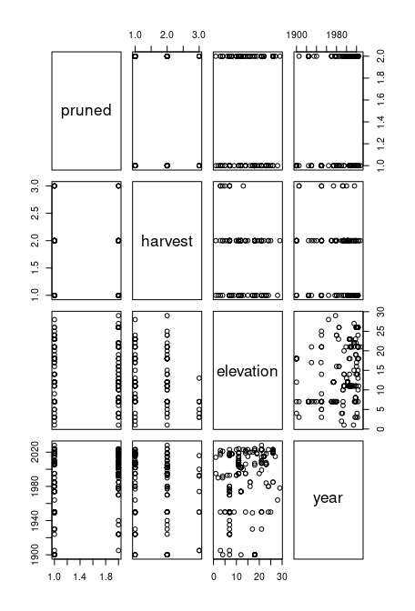
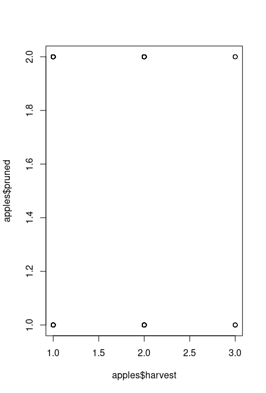
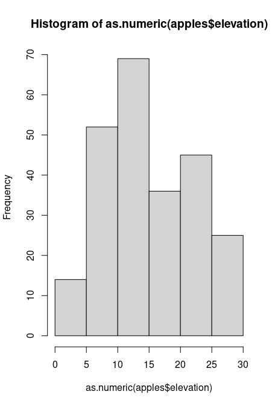
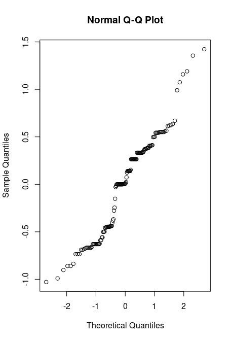
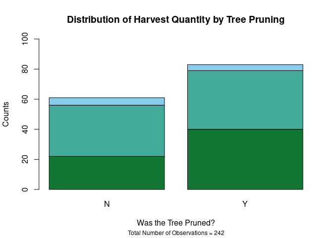
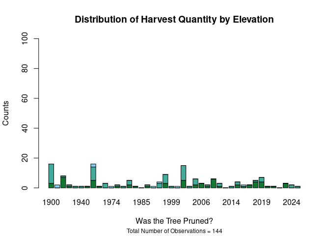

Final Report
================
Kayla Howa
2025-11-12

# ABSTRACT

# BACKGROUND

Apples held the top spot for total fruit available for consumption in
2021 (Kantor and Blazejczyk, 2023) and, according to USApple’s analysis,
total U.S. apple production for the 2025/26 crop year (CY) is forecast
at 11.7 billion pounds / 278.5 million bushels (USApple, 2025). 

With apples being such a hot commodity, it is important to figure out
what factors may be influencing harvest sizes. We have been provided a
dataset

# STUDY QUESTION & HYPOTHESIS

## Question

Does pruning trees lead to an increase in fruit yield in apple trees?

## Hypothesis

I hypothesize that pruning trees leads to an increase in fruit yield in
apple trees.

## Prediction

I predict that by pruning fruit bearing trees, such as apples, the fruit
yield will increase for the following harvest season.

# METHODS

### Method 1

We have fit a simple linear model to the data, with y being the response
variable (harvest amount) and x<sub>1</sub> and x<sub>2</sub> being our
covariate factors (whether the tree was pruned and tree elevation).
Because the pruned covariate is categorical, dummy variables were
automatically created for it. One pruned category is left out in order
to prevent collinearity among the data.

The final model statement for y is:

$$y = \beta_{0} + \beta_{1}x_{1} + \beta_{2}x_{2} + \beta_{3}x_{3} + \epsilon$$
$$\epsilon \sim N(0,\sigma^2)$$

where $\beta$ describes the effects of each predictor on y and
$\epsilon$ are normally distributed residual error terms with a variance
of $\sigma^2$.

### Method 2

We performed a Chi-Square test of independence between our two variables
pruned and harvest

Where pruned is represented as either Yes or No, and

Where harvest is represented as 1, 2, or 3: 1 = Minimal 2 = Average 3 =
Above Average

### Method 3

### Analysis

## First Analysis

``` r
## Create scatterplot matrix to determine relationships
plot(~ pruned + harvest + elevation + year, data = apples)
```



``` r
##Create scatterplot to see relationships
plot(apples$harvest, apples$pruned)
```



``` r
plot(apples$harvest, apples$elevation)
```



``` r
plot(apples$harvest, apples$year)
```



``` r
## Creating a linear model to try and determine whether pruning impacts apple harvest abundance
apple_lm <- lm(harvest ~ pruned + elevation + year, data = apples)
summary(apple_lm)
```

    ## 
    ## Call:
    ## lm(formula = harvest ~ pruned + elevation + year, data = apples)
    ## 
    ## Residuals:
    ##      Min       1Q   Median       3Q      Max 
    ## -1.02866 -0.45672  0.00786  0.37053  1.42281 
    ## 
    ## Coefficients:
    ##                 Estimate Std. Error t value Pr(>|t|)
    ## (Intercept)    3.1553437  3.7225603   0.848    0.398
    ## prunedY       -0.2500719  0.1520753  -1.644    0.103
    ## elevation5500 -0.6361058  0.7129397  -0.892    0.374
    ## elevation5550  0.6632429  0.5051644   1.313    0.192
    ## elevation5580  0.5405692  0.5066688   1.067    0.288
    ## elevation5584  0.8333568  0.5893551   1.414    0.160
    ## elevation5585  0.6162564  0.7140447   0.863    0.390
    ## elevation5600  0.1934423  0.4330166   0.447    0.656
    ## elevation5604 -0.3646577  0.5336553  -0.683    0.496
    ## elevation5616 -0.6666432  0.7175944  -0.929    0.355
    ## elevation5633  0.6162564  0.5850278   1.053    0.294
    ## elevation5663  0.0745083  0.4316352   0.173    0.863
    ## elevation5700  0.2901310  0.4402287   0.659    0.511
    ## elevation5750  0.6303800  0.5836593   1.080    0.282
    ## elevation5770  0.3623673  0.5337460   0.679    0.499
    ## elevation5784  0.1361058  0.5836787   0.233    0.816
    ## elevation5900 -0.5152687  0.5801560  -0.888    0.376
    ## elevation6000  0.0308665  0.4595898   0.067    0.947
    ## elevation6080  0.0106881  0.5795507   0.018    0.985
    ## elevation6250  0.3677114  0.7128990   0.516    0.607
    ## elevation6500  0.0074725  0.4533579   0.016    0.987
    ## elevation6692  0.1345789  0.5836411   0.231    0.818
    ## elevation6700 -0.6251123  0.4903242  -1.275    0.205
    ## elevation6710  0.0152922  0.5355056   0.029    0.977
    ## elevation6720  0.3333568  0.7175944   0.465    0.643
    ## elevation7162 -0.6559551  0.7150935  -0.917    0.361
    ## elevation7200  0.6048049  0.7161604   0.845    0.400
    ## year          -0.0007634  0.0018550  -0.412    0.681
    ## 
    ## Residual standard error: 0.579 on 116 degrees of freedom
    ##   (97 observations deleted due to missingness)
    ## Multiple R-squared:  0.2449, Adjusted R-squared:  0.06911 
    ## F-statistic: 1.393 on 27 and 116 DF,  p-value: 0.1165

``` r
appleResids <- apple_lm$residuals
qqnorm(appleResids)
```


``` r
shapiro.test(appleResids)
```

    ## 
    ##  Shapiro-Wilk normality test
    ## 
    ## data:  appleResids
    ## W = 0.95305, p-value = 8.429e-05

## Second Analysis

``` r
## ANOVA
options(max.print=1000000)
appleANOVA <- aov(apple_lm)
summary(appleANOVA)
```

    ##              Df Sum Sq Mean Sq F value Pr(>F)
    ## pruned        1   0.85  0.8452   2.521  0.115
    ## elevation    25  11.71  0.4683   1.397  0.120
    ## year          1   0.06  0.0568   0.169  0.681
    ## Residuals   116  38.88  0.3352               
    ## 97 observations deleted due to missingness

``` r
TukeyHSD(appleANOVA, which = "elevation")
```

    ##   Tukey multiple comparisons of means
    ##     95% family-wise confidence level
    ## 
    ## Fit: aov(formula = apple_lm)
    ## 
    ## $elevation
    ##                    diff        lwr       upr     p adj
    ## 5500-5400 -5.775232e-01 -3.2505171 2.0954706 1.0000000
    ## 5550-5400  7.112384e-01 -1.1788537 2.6013305 0.9995456
    ## 5580-5400  5.387616e-01 -1.3513305 2.4288537 0.9999969
    ## 5584-5400  9.224768e-01 -1.2600135 3.1049671 0.9973088
    ## 5585-5400  5.775232e-01 -2.0954706 3.2505171 1.0000000
    ## 5600-5400  2.181124e-01 -1.3712187 1.8074435 1.0000000
    ## 5604-5400 -4.224768e-01 -2.4148088 1.5698552 1.0000000
    ## 5616-5400 -5.775232e-01 -3.2505171 2.0954706 1.0000000
    ## 5633-5400  5.775232e-01 -1.6049671 2.7600135 0.9999993
    ## 5663-5400  2.939627e-02 -1.5768731 1.6356657 1.0000000
    ## 5700-5400  2.553328e-01 -1.3815349 1.8922006 1.0000000
    ## 5750-5400  5.775232e-01 -1.6049671 2.7600135 0.9999993
    ## 5770-5400  4.224768e-01 -1.5698552 2.4148088 1.0000000
    ## 5784-5400  7.752321e-02 -2.1049671 2.2600135 1.0000000
    ## 5900-5400 -5.000000e-01 -2.6824903 1.6824903 1.0000000
    ## 6000-5400  1.374795e-01 -1.4940302 1.7689893 1.0000000
    ## 6080-5400 -4.440892e-16 -2.1824903 2.1824903 1.0000000
    ## 6250-5400  4.224768e-01 -2.2505171 3.0954706 1.0000000
    ## 6500-5400  2.971449e-02 -1.6764167 1.7358457 1.0000000
    ## 6692-5400  7.752321e-02 -2.1049671 2.2600135 1.0000000
    ## 6700-5400 -5.775232e-01 -2.4035256 1.2484792 0.9999776
    ## 6710-5400  8.914346e-02 -1.9031885 2.0814754 1.0000000
    ## 6720-5400  4.224768e-01 -2.2505171 3.0954706 1.0000000
    ## 7162-5400 -5.775232e-01 -3.2505171 2.0954706 1.0000000
    ## 7200-5400  5.775232e-01 -2.0954706 3.2505171 1.0000000
    ## 5550-5500  1.288762e+00 -1.1513368 3.7288600 0.9563305
    ## 5580-5500  1.116285e+00 -1.3238136 3.5563832 0.9920042
    ## 5584-5500  1.500000e+00 -1.1729939 4.1729939 0.9203145
    ## 5585-5500  1.155046e+00 -1.9314610 4.2415539 0.9995845
    ## 5600-5500  7.956356e-01 -1.4196760 3.0109472 0.9997894
    ## 5604-5500  1.550464e-01 -2.3650764 2.6751692 1.0000000
    ## 5616-5500  0.000000e+00 -3.0865074 3.0865074 1.0000000
    ## 5633-5500  1.155046e+00 -1.5179474 3.8280403 0.9963139
    ## 5663-5500  6.069195e-01 -1.6205754 2.8344144 0.9999987
    ## 5700-5500  8.328560e-01 -1.4168035 3.0825156 0.9996515
    ## 5750-5500  1.155046e+00 -1.5179474 3.8280403 0.9963139
    ## 5770-5500  1.000000e+00 -1.5201228 3.5201228 0.9989501
    ## 5784-5500  6.550464e-01 -2.0179474 3.3280403 0.9999999
    ## 5900-5500  7.752321e-02 -2.5954706 2.7505171 1.0000000
    ## 6000-5500  7.150027e-01 -1.5307613 2.9607668 0.9999747
    ## 6080-5500  5.775232e-01 -2.0954706 3.2505171 1.0000000
    ## 6250-5500  1.000000e+00 -2.0865074 4.0865074 0.9999652
    ## 6500-5500  6.072377e-01 -1.6933091 2.9077845 0.9999993
    ## 6692-5500  6.550464e-01 -2.0179474 3.3280403 0.9999999
    ## 6700-5500 -4.440892e-16 -2.3907984 2.3907984 1.0000000
    ## 6710-5500  6.666667e-01 -1.8534561 3.1867894 0.9999993
    ## 6720-5500  1.000000e+00 -2.0865074 4.0865074 0.9999652
    ## 7162-5500 -8.881784e-16 -3.0865074 3.0865074 1.0000000
    ## 7200-5500  1.155046e+00 -1.9314610 4.2415539 0.9995845
    ## 5580-5550 -1.724768e-01 -1.7157305 1.3707769 1.0000000
    ## 5584-5550  2.112384e-01 -1.6788537 2.1013305 1.0000000
    ## 5585-5550 -1.337152e-01 -2.5738136 2.3063832 1.0000000
    ## 5600-5550 -4.931260e-01 -1.6486161 0.6623641 0.9969098
    ## 5604-5550 -1.133715e+00 -2.8006197 0.5331893 0.6638962
    ## 5616-5550 -1.288762e+00 -3.7288600 1.1513368 0.9563305
    ## 5633-5550 -1.337152e-01 -2.0238073 1.7563769 1.0000000
    ## 5663-5550 -6.818421e-01 -1.8605216 0.4968374 0.8951019
    ## 5700-5550 -4.559056e-01 -1.6759548 0.7641436 0.9995943
    ## 5750-5550 -1.337152e-01 -2.0238073 1.7563769 1.0000000
    ## 5770-5550 -2.887616e-01 -1.9556661 1.3781429 1.0000000
    ## 5784-5550 -6.337152e-01 -2.5238073 1.2563769 0.9999357
    ## 5900-5550 -1.211238e+00 -3.1013305 0.6788537 0.7677628
    ## 6000-5550 -5.737589e-01 -1.7866101 0.6390923 0.9877189
    ## 6080-5550 -7.112384e-01 -2.6013305 1.1788537 0.9995456
    ## 6250-5550 -2.887616e-01 -2.7288600 2.1513368 1.0000000
    ## 6500-5550 -6.815239e-01 -1.9930374 0.6299896 0.9632697
    ## 6692-5550 -6.337152e-01 -2.5238073 1.2563769 0.9999357
    ## 6700-5550 -1.288762e+00 -2.7528206 0.1752974 0.1717231
    ## 6710-5550 -6.220949e-01 -2.2889995 1.0448096 0.9996026
    ## 6720-5550 -2.887616e-01 -2.7288600 2.1513368 1.0000000
    ## 7162-5550 -1.288762e+00 -3.7288600 1.1513368 0.9563305
    ## 7200-5550 -1.337152e-01 -2.5738136 2.3063832 1.0000000
    ## 5584-5580  3.837152e-01 -1.5063769 2.2738073 1.0000000
    ## 5585-5580  3.876160e-02 -2.4013368 2.4788600 1.0000000
    ## 5600-5580 -3.206492e-01 -1.4761393 0.8348409 0.9999981
    ## 5604-5580 -9.612384e-01 -2.6281429 0.7056661 0.8979643
    ## 5616-5580 -1.116285e+00 -3.5563832 1.3238136 0.9920042
    ## 5633-5580  3.876160e-02 -1.8513305 1.9288537 1.0000000
    ## 5663-5580 -5.093653e-01 -1.6880448 0.6693142 0.9963101
    ## 5700-5580 -2.834288e-01 -1.5034780 0.9366204 1.0000000
    ## 5750-5580  3.876160e-02 -1.8513305 1.9288537 1.0000000
    ## 5770-5580 -1.162848e-01 -1.7831893 1.5506197 1.0000000
    ## 5784-5580 -4.612384e-01 -2.3513305 1.4288537 0.9999999
    ## 5900-5580 -1.038762e+00 -2.9288537 0.8513305 0.9346975
    ## 6000-5580 -4.012821e-01 -1.6141333 0.8115691 0.9999492
    ## 6080-5580 -5.387616e-01 -2.4288537 1.3513305 0.9999969
    ## 6250-5580 -1.162848e-01 -2.5563832 2.3238136 1.0000000
    ## 6500-5580 -5.090471e-01 -1.8205606 0.8024664 0.9992554
    ## 6692-5580 -4.612384e-01 -2.3513305 1.4288537 0.9999999
    ## 6700-5580 -1.116285e+00 -2.5803438 0.3477742 0.4295841
    ## 6710-5580 -4.496181e-01 -2.1165227 1.2172864 0.9999989
    ## 6720-5580 -1.162848e-01 -2.5563832 2.3238136 1.0000000
    ## 7162-5580 -1.116285e+00 -3.5563832 1.3238136 0.9920042
    ## 7200-5580  3.876160e-02 -2.4013368 2.4788600 1.0000000
    ## 5585-5584 -3.449536e-01 -3.0179474 2.3280403 1.0000000
    ## 5600-5584 -7.043644e-01 -2.2936955 0.8849667 0.9947687
    ## 5604-5584 -1.344954e+00 -3.3372856 0.6473784 0.6779741
    ## 5616-5584 -1.500000e+00 -4.1729939 1.1729939 0.9203145
    ## 5633-5584 -3.449536e-01 -2.5274439 1.8375368 1.0000000
    ## 5663-5584 -8.930805e-01 -2.4993499 0.7131889 0.9269770
    ## 5700-5584 -6.671440e-01 -2.3040117 0.9697238 0.9984233
    ## 5750-5584 -3.449536e-01 -2.5274439 1.8375368 1.0000000
    ## 5770-5584 -5.000000e-01 -2.4923320 1.4923320 0.9999998
    ## 5784-5584 -8.449536e-01 -3.0274439 1.3375368 0.9992846
    ## 5900-5584 -1.422477e+00 -3.6049671 0.7600135 0.7402691
    ## 6000-5584 -7.849973e-01 -2.4165070 0.8465125 0.9848582
    ## 6080-5584 -9.224768e-01 -3.1049671 1.2600135 0.9973088
    ## 6250-5584 -5.000000e-01 -3.1729939 2.1729939 1.0000000
    ## 6500-5584 -8.927623e-01 -2.5988935 0.8133689 0.9604271
    ## 6692-5584 -8.449536e-01 -3.0274439 1.3375368 0.9992846
    ## 6700-5584 -1.500000e+00 -3.3260024 0.3260024 0.2826873
    ## 6710-5584 -8.333333e-01 -2.8256653 1.1589987 0.9976876
    ## 6720-5584 -5.000000e-01 -3.1729939 2.1729939 1.0000000
    ## 7162-5584 -1.500000e+00 -4.1729939 1.1729939 0.9203145
    ## 7200-5584 -3.449536e-01 -3.0179474 2.3280403 1.0000000
    ## 5600-5585 -3.594108e-01 -2.5747224 1.8559008 1.0000000
    ## 5604-5585 -1.000000e+00 -3.5201228 1.5201228 0.9989501
    ## 5616-5585 -1.155046e+00 -4.2415539 1.9314610 0.9995845
    ## 5633-5585 -4.440892e-16 -2.6729939 2.6729939 1.0000000
    ## 5663-5585 -5.481269e-01 -2.7756218 1.6793679 0.9999998
    ## 5700-5585 -3.221904e-01 -2.5718500 1.9274691 1.0000000
    ## 5750-5585 -4.440892e-16 -2.6729939 2.6729939 1.0000000
    ## 5770-5585 -1.550464e-01 -2.6751692 2.3650764 1.0000000
    ## 5784-5585 -5.000000e-01 -3.1729939 2.1729939 1.0000000
    ## 5900-5585 -1.077523e+00 -3.7505171 1.5954706 0.9986641
    ## 6000-5585 -4.400437e-01 -2.6858077 1.8057203 1.0000000
    ## 6080-5585 -5.775232e-01 -3.2505171 2.0954706 1.0000000
    ## 6250-5585 -1.550464e-01 -3.2415539 2.9314610 1.0000000
    ## 6500-5585 -5.478087e-01 -2.8483555 1.7527381 0.9999999
    ## 6692-5585 -5.000000e-01 -3.1729939 2.1729939 1.0000000
    ## 6700-5585 -1.155046e+00 -3.5458448 1.2357520 0.9840843
    ## 6710-5585 -4.883797e-01 -3.0085025 2.0317430 1.0000000
    ## 6720-5585 -1.550464e-01 -3.2415539 2.9314610 1.0000000
    ## 7162-5585 -1.155046e+00 -4.2415539 1.9314610 0.9995845
    ## 7200-5585  4.440892e-16 -3.0865074 3.0865074 1.0000000
    ## 5604-5600 -6.405892e-01 -1.9566804 0.6755020 0.9825859
    ## 5616-5600 -7.956356e-01 -3.0109472 1.4196760 0.9997894
    ## 5633-5600  3.594108e-01 -1.2299203 1.9487419 1.0000000
    ## 5663-5600 -1.887161e-01 -0.7742165 0.3967842 0.9999683
    ## 5700-5600  3.722042e-02 -0.6276445 0.7020853 1.0000000
    ## 5750-5600  3.594108e-01 -1.2299203 1.9487419 1.0000000
    ## 5770-5600  2.043644e-01 -1.1117268 1.5204556 1.0000000
    ## 5784-5600 -1.405892e-01 -1.7299203 1.4487419 1.0000000
    ## 5900-5600 -7.181124e-01 -2.3074435 0.8712187 0.9932126
    ## 6000-5600 -8.063287e-02 -0.7321951 0.5709294 1.0000000
    ## 6080-5600 -2.181124e-01 -1.8074435 1.3712187 1.0000000
    ## 6250-5600  2.043644e-01 -2.0109472 2.4196760 1.0000000
    ## 6500-5600 -1.883979e-01 -1.0091250 0.6323292 1.0000000
    ## 6692-5600 -1.405892e-01 -1.7299203 1.4487419 1.0000000
    ## 6700-5600 -7.956356e-01 -1.8430105 0.2517393 0.4372874
    ## 6710-5600 -1.289689e-01 -1.4450601 1.1871223 1.0000000
    ## 6720-5600  2.043644e-01 -2.0109472 2.4196760 1.0000000
    ## 7162-5600 -7.956356e-01 -3.0109472 1.4196760 0.9997894
    ## 7200-5600  3.594108e-01 -1.8559008 2.5747224 1.0000000
    ## 5616-5604 -1.550464e-01 -2.6751692 2.3650764 1.0000000
    ## 5633-5604  1.000000e+00 -0.9923320 2.9923320 0.9750325
    ## 5663-5604  4.518731e-01 -0.8846239 1.7883700 0.9999255
    ## 5700-5604  6.778096e-01 -0.6953105 2.0509297 0.9794213
    ## 5750-5604  1.000000e+00 -0.9923320 2.9923320 0.9750325
    ## 5770-5604  8.449536e-01 -0.9370423 2.6269495 0.9873590
    ## 5784-5604  5.000000e-01 -1.4923320 2.4923320 0.9999998
    ## 5900-5604 -7.752321e-02 -2.0698552 1.9148088 1.0000000
    ## 6000-5604  5.599563e-01 -0.8067722 1.9266848 0.9982955
    ## 6080-5604  4.224768e-01 -1.5698552 2.4148088 1.0000000
    ## 6250-5604  8.449536e-01 -1.6751692 3.3650764 0.9999357
    ## 6500-5604  4.521913e-01 -1.0028023 1.9071848 0.9999838
    ## 6692-5604  5.000000e-01 -1.4923320 2.4923320 0.9999998
    ## 6700-5604 -1.550464e-01 -1.7489120 1.4388192 1.0000000
    ## 6710-5604  5.116203e-01 -1.2703756 2.2936162 0.9999964
    ## 6720-5604  8.449536e-01 -1.6751692 3.3650764 0.9999357
    ## 7162-5604 -1.550464e-01 -2.6751692 2.3650764 1.0000000
    ## 7200-5604  1.000000e+00 -1.5201228 3.5201228 0.9989501
    ## 5633-5616  1.155046e+00 -1.5179474 3.8280403 0.9963139
    ## 5663-5616  6.069195e-01 -1.6205754 2.8344144 0.9999987
    ## 5700-5616  8.328560e-01 -1.4168035 3.0825156 0.9996515
    ## 5750-5616  1.155046e+00 -1.5179474 3.8280403 0.9963139
    ## 5770-5616  1.000000e+00 -1.5201228 3.5201228 0.9989501
    ## 5784-5616  6.550464e-01 -2.0179474 3.3280403 0.9999999
    ## 5900-5616  7.752321e-02 -2.5954706 2.7505171 1.0000000
    ## 6000-5616  7.150027e-01 -1.5307613 2.9607668 0.9999747
    ## 6080-5616  5.775232e-01 -2.0954706 3.2505171 1.0000000
    ## 6250-5616  1.000000e+00 -2.0865074 4.0865074 0.9999652
    ## 6500-5616  6.072377e-01 -1.6933091 2.9077845 0.9999993
    ## 6692-5616  6.550464e-01 -2.0179474 3.3280403 0.9999999
    ## 6700-5616 -4.440892e-16 -2.3907984 2.3907984 1.0000000
    ## 6710-5616  6.666667e-01 -1.8534561 3.1867894 0.9999993
    ## 6720-5616  1.000000e+00 -2.0865074 4.0865074 0.9999652
    ## 7162-5616 -8.881784e-16 -3.0865074 3.0865074 1.0000000
    ## 7200-5616  1.155046e+00 -1.9314610 4.2415539 0.9995845
    ## 5663-5633 -5.481269e-01 -2.1543963 1.0581425 0.9999124
    ## 5700-5633 -3.221904e-01 -1.9590582 1.3146774 1.0000000
    ## 5750-5633  0.000000e+00 -2.1824903 2.1824903 1.0000000
    ## 5770-5633 -1.550464e-01 -2.1473784 1.8372856 1.0000000
    ## 5784-5633 -5.000000e-01 -2.6824903 1.6824903 1.0000000
    ## 5900-5633 -1.077523e+00 -3.2600135 1.1049671 0.9793794
    ## 6000-5633 -4.400437e-01 -2.0715534 1.1914661 0.9999989
    ## 6080-5633 -5.775232e-01 -2.7600135 1.6049671 0.9999993
    ## 6250-5633 -1.550464e-01 -2.8280403 2.5179474 1.0000000
    ## 6500-5633 -5.478087e-01 -2.2539399 1.1583225 0.9999704
    ## 6692-5633 -5.000000e-01 -2.6824903 1.6824903 1.0000000
    ## 6700-5633 -1.155046e+00 -2.9810488 0.6709560 0.7876992
    ## 6710-5633 -4.883797e-01 -2.4807117 1.5039522 0.9999998
    ## 6720-5633 -1.550464e-01 -2.8280403 2.5179474 1.0000000
    ## 7162-5633 -1.155046e+00 -3.8280403 1.5179474 0.9963139
    ## 7200-5633  8.881784e-16 -2.6729939 2.6729939 1.0000000
    ## 5700-5663  2.259365e-01 -0.4784592 0.9303323 0.9999710
    ## 5750-5663  5.481269e-01 -1.0581425 2.1543963 0.9999124
    ## 5770-5663  3.930805e-01 -0.9434164 1.7295774 0.9999943
    ## 5784-5663  4.812693e-02 -1.5581425 1.6543963 1.0000000
    ## 5900-5663 -5.293963e-01 -2.1356657 1.0768731 0.9999526
    ## 6000-5663  1.080832e-01 -0.5837703 0.7999368 1.0000000
    ## 6080-5663 -2.939627e-02 -1.6356657 1.5768731 1.0000000
    ## 6250-5663  3.930805e-01 -1.8344144 2.6205754 1.0000000
    ## 6500-5663  3.182127e-04 -0.8527474 0.8533838 1.0000000
    ## 6692-5663  4.812693e-02 -1.5581425 1.6543963 1.0000000
    ## 6700-5663 -6.069195e-01 -1.6798231 0.4659841 0.9141795
    ## 6710-5663  5.974719e-02 -1.2767497 1.3962441 1.0000000
    ## 6720-5663  3.930805e-01 -1.8344144 2.6205754 1.0000000
    ## 7162-5663 -6.069195e-01 -2.8344144 1.6205754 0.9999987
    ## 7200-5663  5.481269e-01 -1.6793679 2.7756218 0.9999998
    ## 5750-5700  3.221904e-01 -1.3146774 1.9590582 1.0000000
    ## 5770-5700  1.671440e-01 -1.2059761 1.5402640 1.0000000
    ## 5784-5700 -1.778096e-01 -1.8146774 1.4590582 1.0000000
    ## 5900-5700 -7.553328e-01 -2.3922006 0.8815349 0.9910508
    ## 6000-5700 -1.178533e-01 -0.8780480 0.6423414 1.0000000
    ## 6080-5700 -2.553328e-01 -1.8922006 1.3815349 1.0000000
    ## 6250-5700  1.671440e-01 -2.0825156 2.4168035 1.0000000
    ## 6500-5700 -2.256183e-01 -1.1349893 0.6837527 0.9999998
    ## 6692-5700 -1.778096e-01 -1.8146774 1.4590582 1.0000000
    ## 6700-5700 -8.328560e-01 -1.9510496 0.2853375 0.4786419
    ## 6710-5700 -1.661893e-01 -1.5393094 1.2069307 1.0000000
    ## 6720-5700  1.671440e-01 -2.0825156 2.4168035 1.0000000
    ## 7162-5700 -8.328560e-01 -3.0825156 1.4168035 0.9996515
    ## 7200-5700  3.221904e-01 -1.9274691 2.5718500 1.0000000
    ## 5770-5750 -1.550464e-01 -2.1473784 1.8372856 1.0000000
    ## 5784-5750 -5.000000e-01 -2.6824903 1.6824903 1.0000000
    ## 5900-5750 -1.077523e+00 -3.2600135 1.1049671 0.9793794
    ## 6000-5750 -4.400437e-01 -2.0715534 1.1914661 0.9999989
    ## 6080-5750 -5.775232e-01 -2.7600135 1.6049671 0.9999993
    ## 6250-5750 -1.550464e-01 -2.8280403 2.5179474 1.0000000
    ## 6500-5750 -5.478087e-01 -2.2539399 1.1583225 0.9999704
    ## 6692-5750 -5.000000e-01 -2.6824903 1.6824903 1.0000000
    ## 6700-5750 -1.155046e+00 -2.9810488 0.6709560 0.7876992
    ## 6710-5750 -4.883797e-01 -2.4807117 1.5039522 0.9999998
    ## 6720-5750 -1.550464e-01 -2.8280403 2.5179474 1.0000000
    ## 7162-5750 -1.155046e+00 -3.8280403 1.5179474 0.9963139
    ## 7200-5750  8.881784e-16 -2.6729939 2.6729939 1.0000000
    ## 5784-5770 -3.449536e-01 -2.3372856 1.6473784 1.0000000
    ## 5900-5770 -9.224768e-01 -2.9148088 1.0698552 0.9906511
    ## 6000-5770 -2.849973e-01 -1.6517257 1.0817312 1.0000000
    ## 6080-5770 -4.224768e-01 -2.4148088 1.5698552 1.0000000
    ## 6250-5770  0.000000e+00 -2.5201228 2.5201228 1.0000000
    ## 6500-5770 -3.927623e-01 -1.8477559 1.0622313 0.9999989
    ## 6692-5770 -3.449536e-01 -2.3372856 1.6473784 1.0000000
    ## 6700-5770 -1.000000e+00 -2.5938656 0.5938656 0.7996761
    ## 6710-5770 -3.333333e-01 -2.1153292 1.4486626 1.0000000
    ## 6720-5770  0.000000e+00 -2.5201228 2.5201228 1.0000000
    ## 7162-5770 -1.000000e+00 -3.5201228 1.5201228 0.9989501
    ## 7200-5770  1.550464e-01 -2.3650764 2.6751692 1.0000000
    ## 5900-5784 -5.775232e-01 -2.7600135 1.6049671 0.9999993
    ## 6000-5784  5.995632e-02 -1.5715534 1.6914661 1.0000000
    ## 6080-5784 -7.752321e-02 -2.2600135 2.1049671 1.0000000
    ## 6250-5784  3.449536e-01 -2.3280403 3.0179474 1.0000000
    ## 6500-5784 -4.780872e-02 -1.7539399 1.6583225 1.0000000
    ## 6692-5784 -2.220446e-16 -2.1824903 2.1824903 1.0000000
    ## 6700-5784 -6.550464e-01 -2.4810488 1.1709560 0.9997935
    ## 6710-5784  1.162025e-02 -1.9807117 2.0039522 1.0000000
    ## 6720-5784  3.449536e-01 -2.3280403 3.0179474 1.0000000
    ## 7162-5784 -6.550464e-01 -3.3280403 2.0179474 0.9999999
    ## 7200-5784  5.000000e-01 -2.1729939 3.1729939 1.0000000
    ## 6000-5900  6.374795e-01 -0.9940302 2.2689893 0.9991735
    ## 6080-5900  5.000000e-01 -1.6824903 2.6824903 1.0000000
    ## 6250-5900  9.224768e-01 -1.7505171 3.5954706 0.9998934
    ## 6500-5900  5.297145e-01 -1.1764167 2.2358457 0.9999841
    ## 6692-5900  5.775232e-01 -1.6049671 2.7600135 0.9999993
    ## 6700-5900 -7.752321e-02 -1.9035256 1.7484792 1.0000000
    ## 6710-5900  5.891435e-01 -1.4031885 2.5814754 0.9999936
    ## 6720-5900  9.224768e-01 -1.7505171 3.5954706 0.9998934
    ## 7162-5900 -7.752321e-02 -2.7505171 2.5954706 1.0000000
    ## 7200-5900  1.077523e+00 -1.5954706 3.7505171 0.9986641
    ## 6080-6000 -1.374795e-01 -1.7689893 1.4940302 1.0000000
    ## 6250-6000  2.849973e-01 -1.9607668 2.5307613 1.0000000
    ## 6500-6000 -1.077650e-01 -1.0074559 0.7919258 1.0000000
    ## 6692-6000 -5.995632e-02 -1.6914661 1.5715534 1.0000000
    ## 6700-6000 -7.150027e-01 -1.8253382 0.3953327 0.7600559
    ## 6710-6000 -4.833606e-02 -1.4150645 1.3183924 1.0000000
    ## 6720-6000  2.849973e-01 -1.9607668 2.5307613 1.0000000
    ## 7162-6000 -7.150027e-01 -2.9607668 1.5307613 0.9999747
    ## 7200-6000  4.400437e-01 -1.8057203 2.6858077 1.0000000
    ## 6250-6080  4.224768e-01 -2.2505171 3.0954706 1.0000000
    ## 6500-6080  2.971449e-02 -1.6764167 1.7358457 1.0000000
    ## 6692-6080  7.752321e-02 -2.1049671 2.2600135 1.0000000
    ## 6700-6080 -5.775232e-01 -2.4035256 1.2484792 0.9999776
    ## 6710-6080  8.914346e-02 -1.9031885 2.0814754 1.0000000
    ## 6720-6080  4.224768e-01 -2.2505171 3.0954706 1.0000000
    ## 7162-6080 -5.775232e-01 -3.2505171 2.0954706 1.0000000
    ## 7200-6080  5.775232e-01 -2.0954706 3.2505171 1.0000000
    ## 6500-6250 -3.927623e-01 -2.6933091 1.9077845 1.0000000
    ## 6692-6250 -3.449536e-01 -3.0179474 2.3280403 1.0000000
    ## 6700-6250 -1.000000e+00 -3.3907984 1.3907984 0.9976876
    ## 6710-6250 -3.333333e-01 -2.8534561 2.1867894 1.0000000
    ## 6720-6250  0.000000e+00 -3.0865074 3.0865074 1.0000000
    ## 7162-6250 -1.000000e+00 -4.0865074 2.0865074 0.9999652
    ## 7200-6250  1.550464e-01 -2.9314610 3.2415539 1.0000000
    ## 6692-6500  4.780872e-02 -1.6583225 1.7539399 1.0000000
    ## 6700-6500 -6.072377e-01 -1.8245726 0.6100973 0.9767491
    ## 6710-6500  5.942897e-02 -1.3955646 1.5144225 1.0000000
    ## 6720-6500  3.927623e-01 -1.9077845 2.6933091 1.0000000
    ## 7162-6500 -6.072377e-01 -2.9077845 1.6933091 0.9999993
    ## 7200-6500  5.478087e-01 -1.7527381 2.8483555 0.9999999
    ## 6700-6692 -6.550464e-01 -2.4810488 1.1709560 0.9997935
    ## 6710-6692  1.162025e-02 -1.9807117 2.0039522 1.0000000
    ## 6720-6692  3.449536e-01 -2.3280403 3.0179474 1.0000000
    ## 7162-6692 -6.550464e-01 -3.3280403 2.0179474 0.9999999
    ## 7200-6692  5.000000e-01 -2.1729939 3.1729939 1.0000000
    ## 6710-6700  6.666667e-01 -0.9271989 2.2605323 0.9976876
    ## 6720-6700  1.000000e+00 -1.3907984 3.3907984 0.9976876
    ## 7162-6700 -4.440892e-16 -2.3907984 2.3907984 1.0000000
    ## 7200-6700  1.155046e+00 -1.2357520 3.5458448 0.9840843
    ## 6720-6710  3.333333e-01 -2.1867894 2.8534561 1.0000000
    ## 7162-6710 -6.666667e-01 -3.1867894 1.8534561 0.9999993
    ## 7200-6710  4.883797e-01 -2.0317430 3.0085025 1.0000000
    ## 7162-6720 -1.000000e+00 -4.0865074 2.0865074 0.9999652
    ## 7200-6720  1.550464e-01 -2.9314610 3.2415539 1.0000000
    ## 7200-7162  1.155046e+00 -1.9314610 4.2415539 0.9995845

## Third Analysis

``` r
## Pruned Plots
countsPruned <- table(apples$harvest, apples$pruned)
summary(countsPruned)
```

    ## Number of cases in table: 144 
    ## Number of factors: 2 
    ## Test for independence of all factors:
    ##  Chisq = 2.3737, df = 2, p-value = 0.3052
    ##  Chi-squared approximation may be incorrect

``` r
print(countsPruned)
```

    ##    
    ##      N  Y
    ##   1 22 40
    ##   2 34 39
    ##   3  5  4

``` r
barplot(countsPruned, main = "Distribution of Harvest Quantity by Tree Pruning", 
        cex.sub = 0.75, sub = "Total Number of Observations = 242",xlab = "Was the Tree Pruned?", 
        ylab = "Counts", ylim = c(0,100),col = c("#117733", "#44AA99", "#88CCEE"))
```

<!-- -->

``` r
##Elevation Plots
countsElevation <- table(apples$harvest, apples$elevation)
summary(countsElevation)
```

    ## Number of cases in table: 144 
    ## Number of factors: 2 
    ## Test for independence of all factors:
    ##  Chisq = NaN, df = 56, p-value = NA
    ##  Chi-squared approximation may be incorrect

``` r
print(countsElevation)
```

    ##    
    ##     5400 5500 5550 5580 5584 5585 5600 5604 5616 5633 5663 5700 5750 5770 5784
    ##   1    1    1    1    1    0    0   14    3    1    0   13    5    1    0    1
    ##   2    1    0    1    2    1    1   15    0    0    2   11   11    0    3    1
    ##   3    0    0    2    1    1    0    4    0    0    0    0    0    1    0    0
    ##    
    ##     5800 5900 6000 6080 6250 6500 6692 6700 6710 6720 6722 7000 7162 7200
    ##   1    0    2    5    1    0    4    1    5    1    0    0    0    1    0
    ##   2    0    0   12    1    1    5    1    0    2    1    0    0    0    1
    ##   3    0    0    0    0    0    0    0    0    0    0    0    0    0    0

``` r
barplot(countsElevation, main = "Distribution of Harvest Quantity by Elevation", 
        cex.sub = 0.75, sub = "Total Number of Observations = 144",xlab = "Was the Tree Pruned?", 
        ylab = "Counts", ylim = c(0,100),col = c("#117733", "#44AA99", "#88CCEE"))
```

<!-- -->

``` r
##Year Plots
countsYear <- table(apples$harvest, apples$year)
summary(countsYear)
```

    ## Number of cases in table: 144 
    ## Number of factors: 2 
    ## Test for independence of all factors:
    ##  Chisq = NaN, df = 82, p-value = NA
    ##  Chi-squared approximation may be incorrect

``` r
print(countsYear)
```

    ##    
    ##     1900 1905 1924 1930 1935 1940 1949 1950 1964 1970 1974 1977 1978 1980 1984
    ##   1    3    0    7    1    0    0    1    5    1    0    0    1    0    2    1
    ##   2   13    0    1    1    1    1    0    9    0    3    0    1    1    3    0
    ##   3    0    2    0    0    0    0    0    2    0    0    1    0    0    0    0
    ##    
    ##     1985 1990 1992 1993 1995 1999 2000 2002 2003 2005 2006 2007 2008 2010 2013
    ##   1    0    1    0    0    3    0    0    5    0    2    3    1    6    1    0
    ##   2    0    1    0    3    6    1    0   10    1    4    0    1    0    2    0
    ##   3    0    0    1    1    0    0    1    0    0    0    0    0    0    0    0
    ##    
    ##     2014 2015 2016 2017 2018 2019 2020 2021 2022 2023 2024 2028
    ##   1    0    2    1    2    4    4    1    1    0    3    0    0
    ##   2    1    2    0    0    1    3    0    0    0    0    2    1
    ##   3    0    0    1    0    0    0    0    0    0    0    0    0

``` r
barplot(countsYear, main = "Distribution of Harvest Quantity by Elevation", 
        cex.sub = 0.75, sub = "Total Number of Observations = 144",xlab = "Was the Tree Pruned?", 
        ylab = "Counts", ylim = c(0,100),col = c("#117733", "#44AA99", "#88CCEE"))
```

<!-- -->

# DISCUSSION

### Interpretation - First Analysis

### Interpretation - Second Analysis

### Limitations

Issues with Alternate bearing in addition to a lack of year to year
data.

Missing data within rows.

Poorly labeled values -\> what does ‘normal’ ‘above average’ and
‘minimal’ mean? -\> what are they comparing it to? -\> what does it
mean?

# CONCLUSION

# REFERENCES

2025-26 apple production will reach nearly 279 million bushels. USApple.
(2025, August 15).
<https://usapple.org/news-resources/2025-26-apple-crop-outlook>

Kantor, L., & Blazejczyk, A. (2023, May 5). Apples and oranges are the
top U.S. fruit choices. Apples and oranges are the top U.S. fruit
choices \| Economic Research Service.
<https://www.ers.usda.gov/data-products/chart-gallery/chart-detail?chartId=58322>
